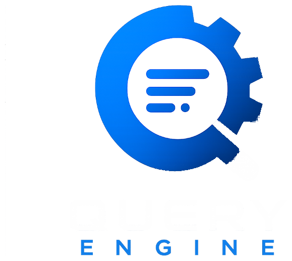

  
  
  # Query Engine
  
  **A lightning-fast, full-stack SQL query engine featuring approximate processing.** 
  *Built with Rust, React, and MongoDB.*
  
   

  
  
  
  
  
  

 

## 🚀 Overview
**Query Engine** is a high-performance, cloud-native analytics platform designed to execute massive SQL aggregations at lightning speeds. Built with a modern, pitch-black sci-fi aesthetic, the platform leverages statistical sampling to deliver **Approximate Query Processing (AQP)**, providing mathematically accurate data estimations up to 100x faster than traditional database scans.

## 📸 Screenshots

| Landing Page | Company Dashboard |
|:---:|:---:|
|  |  |

| The Query Engine | Admin "God Mode" |
|:---:|:---:|
|  |  |

*Note: You can easily replace the placeholder images above by uploading real screenshots of your Vercel deployment to GitHub.*

---

## ✨ Key Features

- **Dual-Engine Architecture**: A seamless in-browser SQL editor that simultaneously runs queries against a traditional exact-match engine and a blazing-fast approximate sampling engine, providing real-time performance comparisons.
- **Role-Based Workspaces**: Secure, sandboxed environments for individual companies to upload `.csv` datasets, track query histories, and monitor execution benchmarks via interactive dashboards.
- **Admin "God Mode"**: A centralized security audit dashboard for platform administrators to monitor global login events, trace user query payloads, and manage cloud storage usage across all tenants.
- **Premium UI/UX**: A fully responsive, custom-built React frontend featuring complex micro-animations (Framer Motion), glassmorphic data cards, and interactive metrics grids optimized for both desktop and mobile devices.

## ⚙️ Architecture

- **Frontend**: `React 18`, `Vite`, `TailwindCSS`, `Framer Motion`, `Recharts`
- **Backend**: `Rust`, `Axum` (High-Performance Async Server), `Tokio`
- **Database**: `MongoDB Atlas` (Cloud NoSQL)
- **Deployment**: `Vercel` (Frontend Edge Network), `Render` (Backend Web Service)

